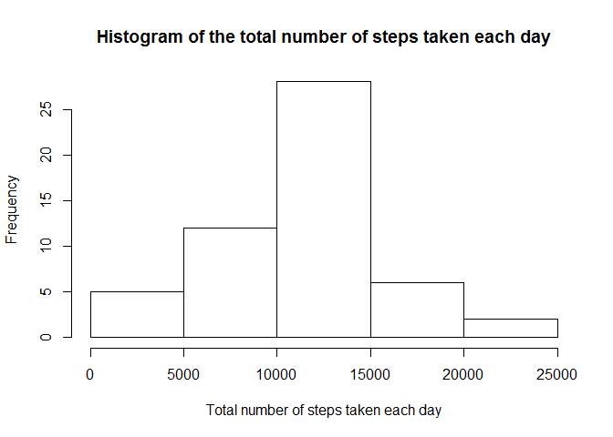
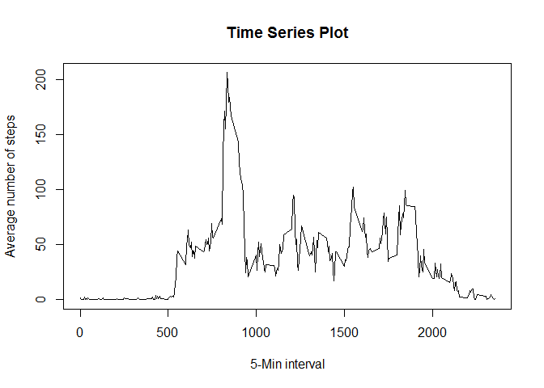
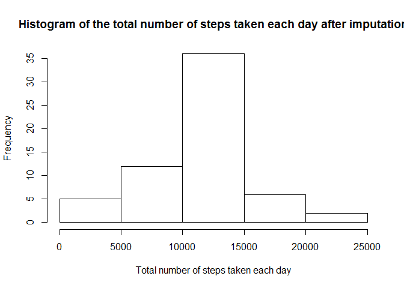
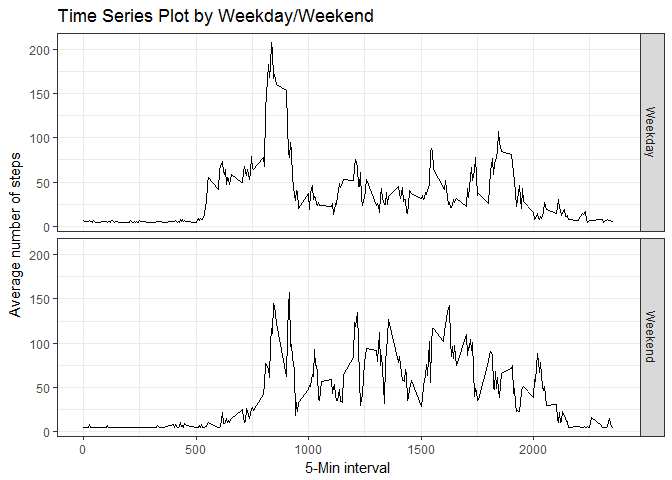

## Loading and preprocessing the data


```r
library(knitr)
library(readr)
library(data.table)
library(ggplot2)
setwd("C:/Users/Hitomi/Documents/GitHub/Reproducible_Research_Week2/RepData_PeerAssessment1")
activity <- read_csv("activity.csv")
```

```
## Parsed with column specification:
## cols(
##   steps = col_integer(),
##   date = col_date(format = ""),
##   interval = col_integer()
## )
```

```r
# calculate the total steps per day
daily <- setDT(activity)[, .(daily.steps=sum(steps)), by=date]
```

## What is mean total number of steps taken per day?


```r
hist(daily$daily.steps, xlab="Total number of steps taken each day", main="Histogram of the total number of steps taken each day") # histogram
```

<!-- -->

```r
mean(daily$daily.steps, na.rm=T) # mean total daily steps
```

```
## [1] 10766.19
```

```r
median(daily$daily.steps, na.rm=T) # median total daily steps
```

```
## [1] 10765
```

 - The mean of total number of steps taken per day is 1.0766189\times 10^{4}.  

 - The median of total number of steps taken per day is 10765.

## What is the average daily activity pattern?


```r
# calculate the average steps by interval
inter <- setDT(activity)[, .(interval.steps=mean(steps, na.rm=T)), by=interval]

plot(inter$interval, inter$interval.steps, type="l", xlab="5-Min interval", ylab="Average number of steps",
     main="Time Series Plot") # time-series plot
```

<!-- -->

```r
inter[which.max(inter$interval.steps),1]$interval # the interval that contains the maximum number of steps
```

```
## [1] 835
```

- On average across all the days in the dataset, the 5-minute interval that contains the maximum number of steps is 835.

## Imputing missing values


```r
sum(!complete.cases(activity)) # the total number of rows with missing data
```

```
## [1] 2304
```

```r
sum(is.na(activity$steps)) # missing data of the variable steps
```

```
## [1] 2304
```

```r
sum(is.na(activity$date)) # missing data of the variable date
```

```
## [1] 0
```

```r
sum(is.na(activity$interval)) # missing data of the variable interval
```

```
## [1] 0
```

```r
# impute the data by inserting the mean values
activity.mi <- activity
activity.mi$steps[is.na(activity.mi$steps)] <- mean(activity.mi$steps, na.rm=T)

# activity.mi is the new dataset that is equal to the original dataset but with the missing data filled in

daily.mi <- setDT(activity.mi)[, .(daily.steps=sum(steps)), by=date]
hist(daily.mi$daily.steps, xlab="Total number of steps taken each day", main="Histogram of the total number of steps taken each day after imputation") # histogram
```

<!-- -->

```r
mean(daily.mi$daily.steps, na.rm=T) # mean total daily steps after imputing missing values
```

```
## [1] 10766.19
```

```r
median(daily.mi$daily.steps, na.rm=T) # median total daily steps after imputing missing values
```

```
## [1] 10766.19
```

- There are 2304 of rows in the dataset that have missing values.

- After imputation, the mean of total number of steps taken per day is 1.0766189\times 10^{4}; The median of total number of steps taken per day is 1.0766189\times 10^{4}. The mean value of new dataset equals to the mean value of the original dataset, but the medians are different.

## Are there differences in activity patterns between weekdays and weekends?


```r
# Create a new factor variable in the dataset with two levels -- "weekday" and "weekend" indicating whether a given date is a weekday or weekend day
activity.mi$weekday <- weekdays(activity.mi$date)
activity.mi$weekday.bi[activity.mi$weekday %in% c("Monday","Tuesday","Wednesday","Thursday","Friday")] <- "Weekday"
activity.mi$weekday.bi[activity.mi$weekday %in% c("Saturday","Sunday")] <- "Weekend"

# time-series plot
wkd <- setDT(activity.mi)[, .(interval.steps=mean(steps)), by=list(interval, weekday.bi)] # calculate the average steps by interval and weekday/weekend

ggplot(wkd, aes(interval, interval.steps)) + geom_line() + facet_grid(weekday.bi ~ .) +
  xlab("5-Min interval") + ylab("Average number of steps") + ggtitle("Time Series Plot by Weekday/Weekend") + theme_bw()
```

<!-- -->

- Yes, there do exist differences in activity patterns between weekdays and weekends.
